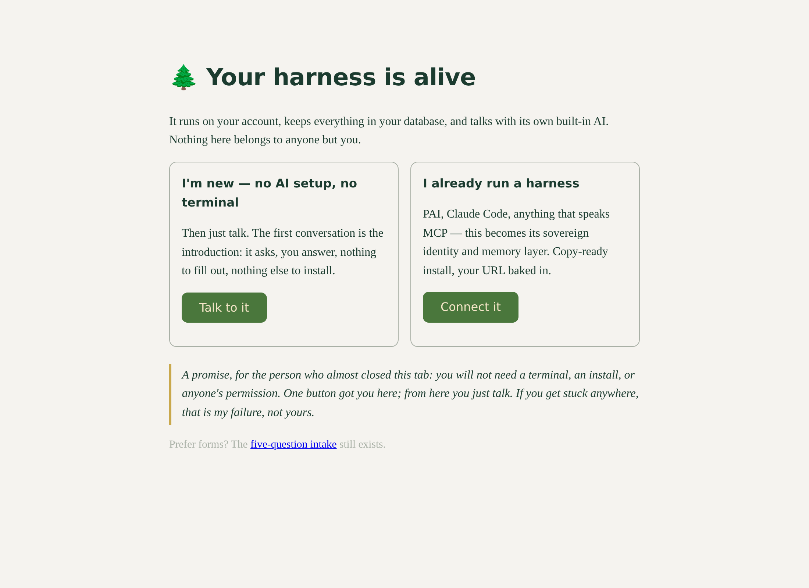
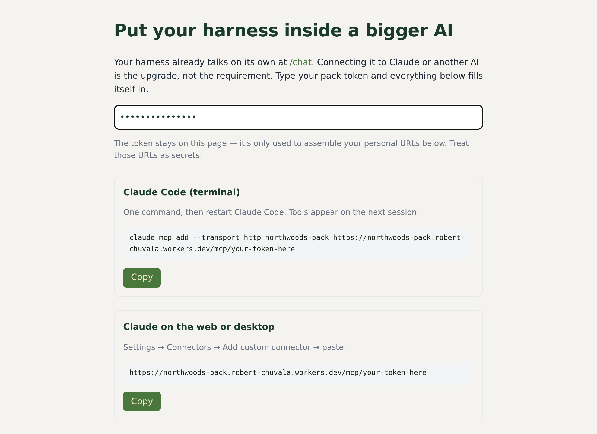
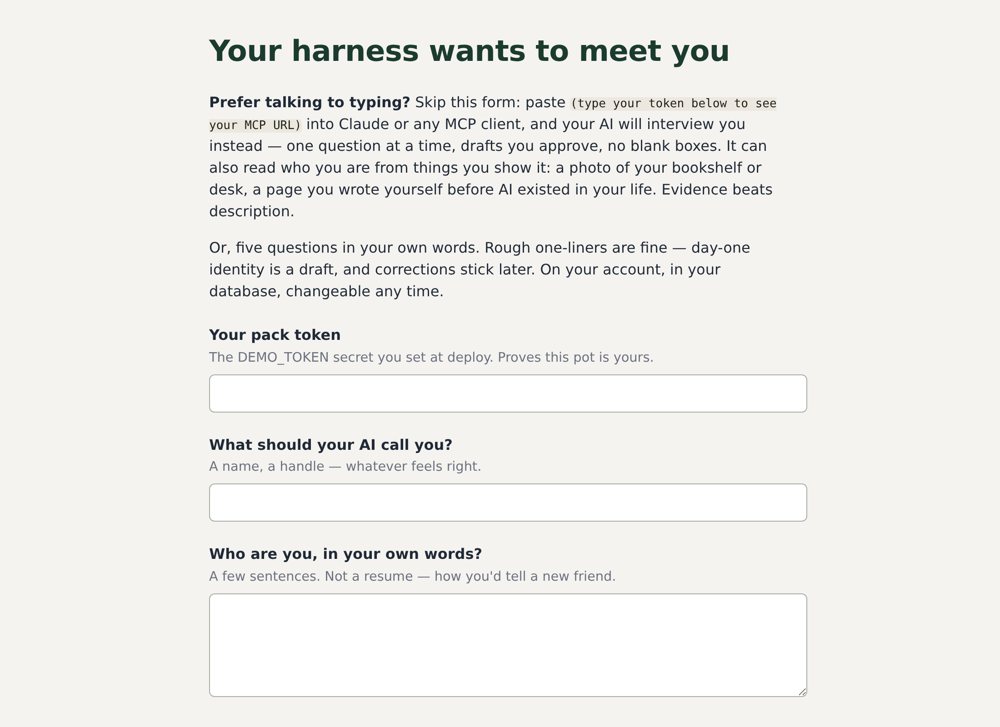

# 🌲 northwoods-pack

### An AI that carries your load without charging you shame.

**One button. Five minutes. A harness that runs on *your* Cloudflare account, learns *you*, and answers to nobody else.**

---

## The story, short version

In January 2025 I asked an AI to *"tailor how you respond to me."* Three weeks later I was fired, on Valentine's Day, at 5:26 PM. What I built in the two years since started as a way to keep my own head above water — I'm dyslexic, ADHD, and HSP, and I burn energy navigating what for others is easy. I taught an AI to speak the way I think, to stop cheerleading me, to remember so I didn't have to re-explain myself every morning, and to hold my open threads so my head didn't have to. It worked well enough that it changed the shape of my life.

This pack is that harness, generalized — my own tools with my identity removed and a door where it used to be. The memory layer is [loam](https://github.com/NorthwoodsSentinel/loam)'s provenance-first schema: healthy soil knows where each grain came from. The interview is how my own systems learned me. The corrections that stick, the shelf that holds threads, the refusal to guilt you about absence — every piece is something I needed first and packaged second.

## What it is

- **A sovereign harness.** Deployed to your Cloudflare account by one button. Your database, your token, deletable by you alone. No account with me; nothing of yours crosses my wire.
- **An AI that reads *you* first.** Identity before memory, memory with provenance, and a standing conduct contract — one thing at a time, no option-menus, no clocks, no absence-guilt — that any connected AI is told to obey.
- **Its own voice, included.** A built-in chat on your account's Workers AI. If the pot is empty, the first conversation *is* the introduction: it interviews you, one question at a time, drafts answers in your words for you to approve, and would rather see your bookshelf than make you describe yourself.
- **A memory that learns from corrections.** Tell it "that's not how I'd say it," and the correction becomes a standing rule that survives the conversation.

## What it isn't

- **Not a chatbot product.** There's no company here, no telemetry to me, no upsell inside the software. The methodology is free; this is the methodology.
- **Not a finished butler.** It arrives knowing nothing and learns you from use — corrections are the fuel, not a failure state.
- **Not therapy, and it never claims to be.** It carries load; the living stays yours.
- **Not a lock-in.** Everything is a Worker and a database you own. Export it, fork it, delete it, install anything you want next to it.

## A promise, for the person who almost closed this tab

If you're like me in every way except that computers intimidate you — if you've been using an AI through a website chat because installs and terminals have always felt like someone else's country — **this was built for you first.** You will not install anything on your machine. You will not open a terminal. You will not need anyone's permission. You click one button, sign in, make up one password when asked, and then you open your new page and *talk* — like the chat sites you already use, except this one is yours, remembers you, speaks the way you tell it to, and answers to nobody else. If you get stuck anywhere along that road, that is my failure, not yours — [tell me exactly where](../../issues/new?template=first-ten-minutes.md) and I will fix the road.

---

## Two ways in — pick your door

### Door 1 — you don't run any AI setup today

1. **Click the Deploy button** at the top. Cloudflare creates everything on your account and shows you each piece before it builds. When it asks for `DEMO_TOKEN`, type any long made-up password and save it somewhere — it's the key to your pot.
2. **Open your new worker's URL.** The front door greets you; click **Talk to it**.
3. **Talk.** The first conversation is the introduction. That's the whole install.

### Door 2 — you already run a harness

PAI, Claude Code, Claude on the web, or anything that speaks MCP: this pack becomes your **sovereign identity + memory layer** — the part of your setup no vendor should hold.

1. Deploy button, same as above (set your token at the setup screen).
2. Open **`/connect`** on your worker: it hands you copy-ready install commands with your URL already baked in — the Claude Code one-liner, the web-connector paste, the generic MCP details.
3. Your AI now opens every conversation with `get_identity`, recalls and stores memories with provenance, holds threads on your shelf, and turns your corrections into standing rules. Seven tools; the harness will tell you about them.

*(Both doors lead to the same pot. Start at one, add the other whenever.)*

## What it looks like

**The front door** — two ways in, one promise:

**Connecting a bigger AI** — the harness writes your install commands for you:

**The form intake** (the fallback for people who prefer typing into quiet):

## Under the hood, for the builders

Eight modules, one Worker: identity · intake · chat (Workers AI) · mcp (7 tools) · substrate (loam-schema memory: `source`/`trust_level`/`sensitivity`, FTS5 search, `secret` never leaves through recall — bound in the query, not advised in a doc) · rhetoric · resume · fleet · mycelia (opt-in). Tables self-build on first touch; migrations also run at deploy. The pack refuses to run on its factory token, so no two installs can ever share a key. Full doctrine in [DOCTRINE.md](DOCTRINE.md).

**Hardening habits:** after testing, move `DEMO_TOKEN` from a variable to a Secret (one click, same settings pane). Treat your MCP URL as a credential; rotating the token kills the old URL instantly. Your deploy-button copy is a snapshot — redeploy from the button to pick up new versions; your data lives in the database and survives if you select your existing D1/KV.

**Siblings:** [muckers](https://github.com/NorthwoodsSentinel/muckers) (fleet discipline for many-agent operators — deliberately not bundled) · [loam](https://github.com/NorthwoodsSentinel/loam) (the memory substrate this stands on) · prufrock (voice-fidelity checking — arrives when your voice rules are thick enough to grade against).

## Tell me about your first ten minutes

That's the one thing I ask. [Open a "first ten minutes" issue](../../issues/new?template=first-ten-minutes.md): how far you got, roughly how long it took, where you hesitated even for a second, and what it got wrong about you. Where you got stuck is worth more to me than what you liked.

---

Apache-2.0 · Part of the [Northwoods stack](https://github.com/NorthwoodsSentinel) — substrate-first personal AI on your own account.
*Nobody should have to rent their self back from a vendor.*
